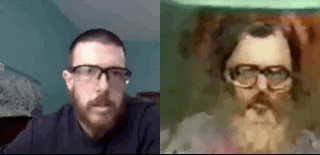

## Apparition

Goal is to make a Apparition using old youtube footage. Will have live actor filmed with webcam during show whose pose gets transformed into real time Apparition Poses shown to audience, with voice impressonation reading lines scripted from dialogue AI. 

*   Using https://github.com/datitran/face2face-demo
*   youtube video here https://www.youtube.com/watch?v=DjbQaSPPsqA
*   saved into .mp4 with https://www.onlinevideoconverter.com/youtube-converter 

Instructions:
* Connect colab to google drive 
* save the .mp4 video into a folder, 
* download the facial landmark model from http://dlib.net/files/shape_predictor_68_face_landmarks.dat.bz2
* after uncompressing locally and saving to google drive 

Tactics:
* Convert video into side by side images of video and face structure
* Train model on these side by side images to predict DelClose from Face pose
* Use live webam to get new face structure
* Convert new face structure to Apparition pose with model in real time
